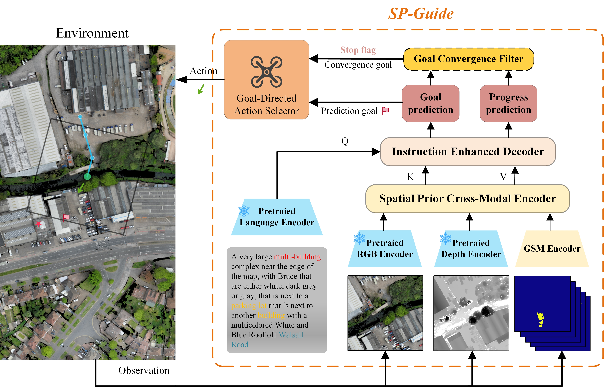
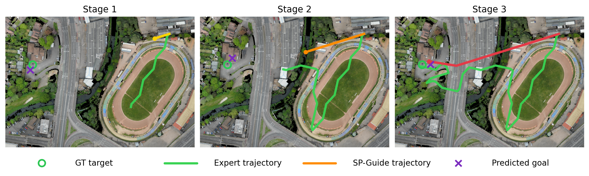

This repository contains the official implementation of the paper: SP-Guide: Enhancing Aerial Vision-Language Navigation with Spatial Priors.

---
## Overview

This work proposed a transformer-based goal-prediction framework including a **Spatial Prior Cross-Modal Encoder**, an **Instruction Enhanced Decoder**, and a **Goal Convergence Filter** for terminal target refinement. 

Our proposed framework is as followed:


The image below shows a flying process.


---
## Setup

### 1. Clone the repository

```bash
git clone https://github.com/Dongzhou-1996/SP-Guide.git
cd SP-Guide
```
### 2. Create and activate the Python environment
```bash
conda env create --name spguide --file conda_env.txt
```
### 3. Download CityNav dataset
Follow the official instructions on the [CityNav repo]([citynav/README.md at main · water-cookie/citynav](https://github.com/water-cookie/citynav))
Use the original CityNav data preparation flow from `scripts/download_data.sh`
and `scripts/rasterize.sh`. The expected layout is:

```text
data/
├─ cityrefer/
├─ citynav/
├─ rgbd/
└─ gsam/

```
---
## Running experiments
### 1. train
train SP-guide model as below
```bash
python3 main_goal_predictor.py   --mode train   --model instr_decoder_usc_with_map   --altitude 50   --gsam_use_segmentation_mask   --gsam_box_threshold 0.20   --gsam_use_map_cache   --learning_rate 0.0015   --train_batch_size 12   --train_trajectory_type mturk   --eval_max_timestep 20
```
### 2.eval
eval the model with goal convergence filter model
```bash
python main_goal_predictor.py   --mode eval   --data_root ./data   --model instr_decoder_usc_with_map   --altitude 50   --eval_max_timestep 20   --gsam_box_threshold 0.20   --gsam_use_segmentation_mask   --gsam_use_map_cache   --checkpoint ./checkpoints/baseline_with_map/instr_decoder_usc_with_map/mturk_50.0_0.2/009.pth  --eval_agent_mode gcf
```
---
## Contact 
For any issues, please feel free to contact me (25S004022@stu.hit.edu.cn). Thank you!

## Acknowledgements
This repo is developed from [CityNav](https://github.com/water-cookie/citynav).Thanks for the authors!